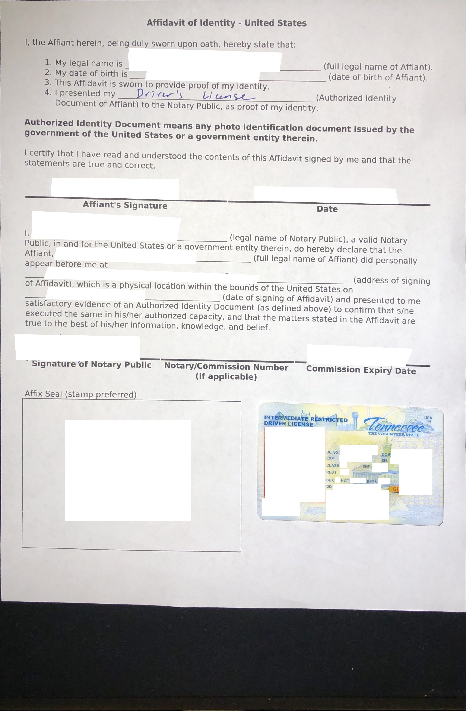

# What is this?
This is a tool I made to explore data from Facebook's Ad Library API, particularly for US election ads. This tool features a "word cloud" that allows you to explore words and other related words to get a general sense of the sentiment surrounding the chosen word. Ads can also be seen along with their demographic and regional breakdowns to obtain a sense on who and where was the ad targeted towards. Additionally, ads targeting a particular demographic or region can be filtered to detect a candidate's campaigning strategy for different groups of people. 

# Dependencies
+ rust + cargo >= 1.39.0
+ python3
    + spacy 2.2.3
    + gensim 3.8.1

# Installation
1. Install the latest version of rust and cargo.
2. Install spacy and a language model
    1. Install spacy: `pip3 install spacy`
    2. Install the language model: `python3 -m spacy download en_core_web_md`
4. Install gensim: `pip3 install gensim`
5. Compile/build the project
    1. Clone the project
    2. `cd` into the rust project directory: `cd ./data_collector`
    3. Build the project: `cargo build --release`
        + Note: There may be dependency issues when building. These issues likely are stemming from OpenSSL when `actix-web` is obtaining its dependencies. Install the following dependencies: `pkg-config, openssl, libssl-dev`.
# Usage
#### BEFORE RUNNING THIS PROGRAM MAKE SURE TO READ THE SECTION BELOW ON HOW TO OBTAIN AN API KEY.

The first thing to note is that this project is broken into two parts: `data_collector` and `scripts`. The former holds Rust code while the latter holds Python code that handles the NLP operations. The `data_collector` project is a binary that functions in two ways. First, it allows you to collect ads from the Facebook Ad Library API from a campaign released during a specified time frame. Once all the ads are collected, a `json` file will be generate holding all _unique_ ads along with some extra data such as demographic and regional data. Secondly, through this binary you can also launch a web server that allows for exploration of the data generate (more on this later).

## Collecting ads
Once the `data_collector` project has been compiled/built, a CLI tool be available. You can install the binary, but instead we'll just `cd` into the `data_collector` directory and run `cargo run --release` to execute the binary. For a more detailed explanation for the various collecting parameters run `cargo run --release collect --help`. To collect data, we simply execute the binary with the subcommand `collect` followed by a list of parameters. 

Example: `cargo run --release collect --access_token=<ACCESS_TOKEN> --ad_status=ALL --year_start=2020 --month_start=2 --day_start=1 --year_end=2020 --month_end=3 --day_end=31 --page_ids=124955570892789 --save_path=./SAVE_DIR/`.

In the above example, the program will collect `ALL` ads from Bernie Sander's campaign (`page_ids=124955570892789`) published from Feb 1, 2020 to Mar 31, 2020. The results will be saved to the directory `./SAVE_DIR/` as `ad_data.json`. A sample of the `ad_data.json` will be shown below.

```json
{
    "When we stand up and fight back, we can take on a corrupt political system and a rigged economy. We can end the greed of the billionaire class and the corporate elite. We can create a government that works for all of us and not just the 1 percent. And it starts with you coming out to vote on Tuesday, February 11.": {
            "demographic_impression": {
                "male/25-34": [
                    3293.31,
                    4390.860446
                ],
                <snip>
            },
            "region_impression": {
                "New Hampshire": [
                    15000.0,
                    19999.0
                ]
            }
    <snip>
}
```

Each item in the `json` object will have a key holding the ad's content. The value will hold demographic information and regional information that hold both a lower bound and upper bound on the number of impressions made. 

Some notable page ids are `153080620724` and `7860876103` which refer to the Trump and Biden campaign, respectively.

In the situation when the program fails during ad collection (eg. having an expired access token, being rate limited, etc), the program will terminate and generate `ad_data.json` with the currently collected ads. To resume ad collection, note the last endpoint the program contacted which should be seen in stdout. Rerun the `collect` command but set the `--endpoint` flag to the earlier noted endpoint. You may need to edit the url to hold your new access token. Then use the `merge` subcommand to merge the two `ad_data.json` files together into one bigger one.

## Processing Ads

### Preprocessing step
Now that we have collected ads it is time to perform analysis on the ads. To do this `cd` into the `scripts/` directory. First we need to preprocess our ads. This step reads in all the ad messages, remove stop words along with other unnecessary tokens, normalize words (lowercase words, convert words to base lemma, and merge multiple tokens forming proper noun into a single token), and generate NLP models for later analysis. 

Example: `python3 preprocess.py SAVE_DIR/ad_data.json SAVE_DIR/models --num_topics=20 --doc2vec_epochs=100 --doc2vec_workers=4`

In the above example, we are pointing to `preprocess` script to the generated `ad_data.json` file and telling it to save the NLP models into a `models` folder in the directory holding the ad data. The other flags are for more fine-tuned control over how the NLP models will be generated. Run `python3 preprocess.py --help` for more information regarding the various parameters.

### Generating association graph step
This step takes the preprocess data from the last step and forms a "word cloud" of terms used in the ads. Terms that are "related" to each other will be connected in the "word cloud". More formally, each term is a node in a graph with edges in this graph representing the property of two nodes being related. How "relatedness" is computed can be found in `associate_words.py` but at a high level, if there is some kind of syntactical/grammatical relationship between two words, a connection will be made. For example, "Trump will fight the opioid crisis." will produce the nodes: "trump", "fight", "opioid" and "crisis". The script would then associate "trump" with "fight", "trump" with "crisis", "fight" with "crisis", and "opioid" with "crisis". 

Example: `python3 associate_words.py SAVE_DIR/models/corpus_data.json SAVE_DIR/`

Notice that we point to the script to `corpus_data.json` which was saved in the preprocessing step inside the `models` directory. Once the script finishes, `association_graph.json` will be in the `SAVE_DIR/` directory.

```json
{
    <snip>
    "billionaire": [
            {
                "word": "class",
                "docs": [
                    0,
                    260,
                    267,
                    13,
                    271,
                    <snip>
                ]
            },
            {
                "word": "buy",
                "docs": [
                    8
                ]
            },
            {
                "word": "bloomberg",
                "docs": [
                    8,
                    72,
                    27,
                    200
                ]
            },
            <snip>
        ],
    <snip>
}
```

The above snippet shows some of the words that were associated with "billionaire" (eg. "class", "buy", "bloomberg", ...) seen in Sander's ads. The numbers inside the `docs` key are indices that point to a particular ad which can be found in the `corpus_data.json` file. For example, if I were to go to `corpus_data.json` and look at the array under the `raw_corpus` key, I might find that the ad at index 8 to be: 
>"Add your name to tell the DNC that they cannot allow billionaires like Michael Bloomberg to buy their way onto the debate stage. They just dropped the individual donor requirement for the next debate. Our job is to show them that millions of people want the Democratic Party to be a true grassroots party, and that when we are in the White House, it will be."

Note that my results will likely be different from yours if you are following along due to the non-deterministic behavior of how `HashMap`'s are serialized and generated during the ad collection step.

## Viewing the results
Now that we have collected the ads and processed them, we can now view the data which is the second function of the `data_collector` project. However, before viewing, we need to load the web server with our newly created data. Add a directory to `data_collector/web/data` holding `ad_data.json`, `association_graph.json`, and `models/`. If the directory `data` doesn't appear, simply make it. In this example, I will add a directory with path `data_collector/web/data/bernie` holding the data and model files. Once you have loaded the data, it is time to launch the web server. To do this, `cd` into `data_collector` and run `cargo run --release launch 127.0.0.1:8080`. To view the data go to: `127.0.0.1:8080/explore/DIR_NAME`. In my case, I will go to: `127.0.0.1:8080/explore/bernie`.

## What about `similarity.py`?
This script is used by the web server to showcase words the user might be interested in and ads similar to a particular ad. If for whatever reason you would like to programmatically get those results, you can find more information by runing `python3 similarity.py interesting_words --help` or `python3 similarity.py similar_docs --help`. Note that `MODEL_PATH` in the help pages would be the directory `models/` that we generated earlier.

# Quick Usage
If you don't care to do all the above steps (understandably), you can simply use the `analyze.sh` script. Before running it, edit the script and modify the variables at the top of the file so that the script knows how it should collect and process the ads. Save the file, make the script executable, and run it with `./analyze.sh`. Flexibility is slightly lost but the script will do all the above steps for you and launch the web server.

If you want to simply try out the web interface and not go through the trouble of obtaining data, there is a tar ball in `data_collector/web/` that when extracted will generate a `data` folder holding ad data from multiple candidates. Once you have extracted that files, launch the web server (see above) and navigate to `127.0.0.1:8080/explore/CANDIDATE_NAME`. The data was collected by grabbing all ads published from `2019/1/1 - 2020/2/23`.

# Extra information
## Getting access to the Facebook Ad Library API
Go to https://www.facebook.com/ads/library/api and follow the steps outlined. Note that in order to gain access to the API you _must_ have a Facebook account AND be authorized to run election ads. It is not enough to have a Facebook account. Once you have gained access, you should see a screen like the one below. 


This process took me a few weeks. You will be asked to provide an image of a valid form of identification and provide an address. Facebook will then send a letter to your address with a code that you will input. You may also need to answer questions regarding geographic landmarks around your address to demonstrate your residence. If like me the identification step fails, you will be asked to have a notarized form signed which you will image and send. I found that this process can be expedited if you place your ID on top of the notarized form but not obscuring any of the text (seen below).



Once you have access to the API, register your application on Facebook's Developers page and then go to https://developers.facebook.com/tools/explorer/ for your API key. Generate an API key, but if you think you will be download many ads I do not recommend using the key provided after clicking "Generate Access Token". This will be a short lived key that may expire before you have downloaded all your ads. Thus to get a longer lived key, click the "i" icon and click "Open in Access Token Tool". There you can click on "Extend Access Token".


## Finding ad campaigns
To find campaigns for analysis, go to https://www.facebook.com/ads/library/report/?source=archive-landing-page&country=US. There you will find a list of advertisers.


Click on a campaign, and you will be led to a page showcasing the recent ads published. You can obtain this campaign's page id for the program by looking at the URL.


